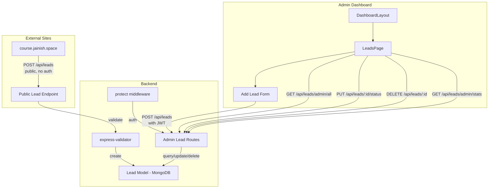
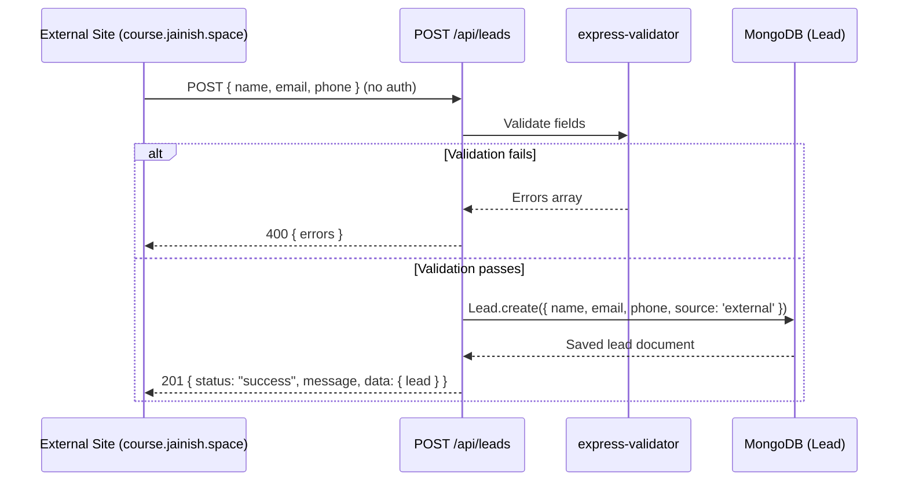
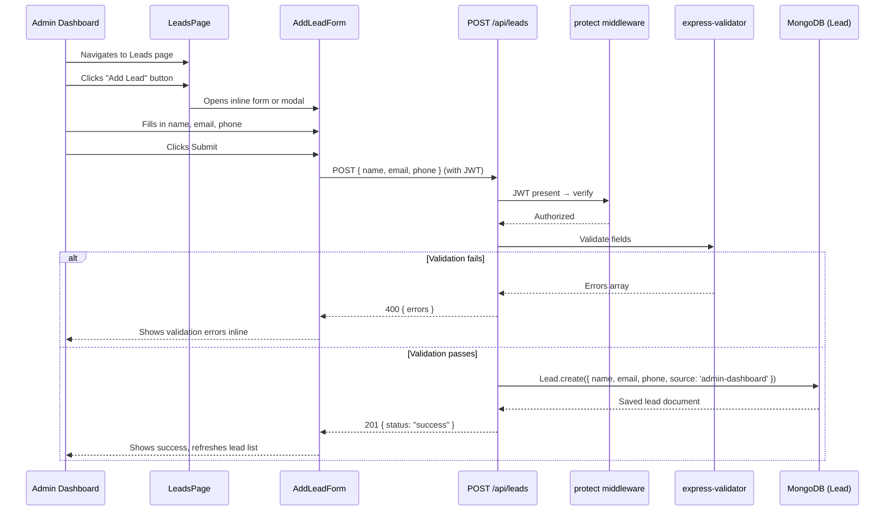
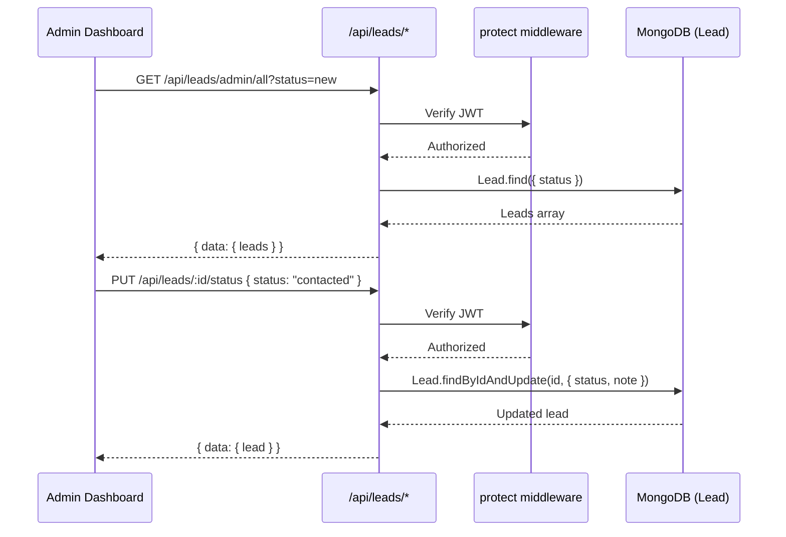

# Design Document: Lead Management

## Overview

The Lead Management feature adds a lead capture and management system to the portfolio application. Leads can be submitted from two sources: (1) external websites (e.g., course.jainish.space) via a public `POST /api/leads` endpoint that requires no authentication, and (2) the admin dashboard where the administrator can manually add leads via an "Add Lead" form.

The admin dashboard provides a LeadsPage for viewing, filtering, updating status/notes, and deleting leads. The portfolio website itself (jainish.space) does NOT have any lead form or CTA button — the ContactSection remains unchanged.

This integrates into the existing backend (Express + Mongoose) and frontend (React + Tailwind), following the same patterns as blogs, games, and comments.

## Architecture



## Sequence Diagrams

### External Lead Submission Flow



### Admin Add Lead Flow



### Admin Lead Management Flow



## Components and Interfaces

### Component 1: Lead Mongoose Model (`Backend/models/Lead.js`)

**Purpose**: Defines the MongoDB schema for storing lead data.

```javascript
// Schema fields
{
  name:      { type: String, required: true, trim: true, maxlength: 100 },
  email:     { type: String, required: true, lowercase: true, trim: true, match: /^\S+@\S+\.\S+$/ },
  phone:     { type: String, required: true, trim: true, maxlength: 20 },
  status:    { type: String, enum: ['new', 'contacted', 'qualified', 'closed'], default: 'new' },
  note:      { type: String, trim: true, maxlength: 500, default: '' },
  source:    { type: String, trim: true, default: 'external' },
  createdAt: { type: Date, default: Date.now },
  updatedAt: { type: Date, default: Date.now }
}
```

**Responsibilities**:
- Persist lead contact information
- Track lead lifecycle status
- Store admin notes per lead
- Track lead source (`external` for API submissions, `admin-dashboard` for manual entries)
- Index on `status` and `createdAt` for efficient admin queries

### Component 2: Lead Routes (`Backend/routes/leads.js`)

**Purpose**: Express router handling all lead operations. The public submission endpoint requires no auth; all admin endpoints are protected by JWT.

```javascript
// PUBLIC endpoint — no authentication required
POST   /api/leads                // Submit a new lead (public API for external sites)

// ADMIN endpoints — require JWT authentication via protect middleware
GET    /api/leads/admin/all      // List all leads, optional ?status= filter
GET    /api/leads/admin/stats    // Lead counts by status
PUT    /api/leads/:id/status     // Update lead status and/or note
DELETE /api/leads/:id            // Delete a lead
```

**Responsibilities**:
- Accept public lead submissions from external websites (no auth)
- Validate incoming lead data with express-validator
- Determine source based on presence of JWT (`admin-dashboard` if authenticated, `external` if not)
- Serve filtered lead lists to admin
- Update lead status and notes
- Delete leads

### Component 3: Frontend API Functions (`src/services/api.js` additions)

**Purpose**: Client-side functions to interact with lead endpoints from the admin dashboard.

```javascript
// Public submission (no auth needed — used by external sites via cURL, not from the React app)
// POST /api/leads

// Admin functions (all use getAuthHeaders() for JWT authentication)
createLead(leadData)              // POST /api/leads (with JWT → source: 'admin-dashboard')
fetchAllLeads(params)             // GET /api/leads/admin/all
fetchLeadStats()                  // GET /api/leads/admin/stats
updateLeadStatus(id, data)        // PUT /api/leads/:id/status
deleteLead(id)                    // DELETE /api/leads/:id
```

### Component 4: LeadsPage (`src/pages/LeadsPage.jsx`)

**Purpose**: Admin dashboard page for adding, viewing, and managing leads. Includes an "Add Lead" button that opens an inline form or modal for manually entering lead information.

**Responsibilities**:
- Display an "Add Lead" button that opens a form (inline or modal) for entering name, email, phone
- Client-side validation of the add lead form before submission
- Fetch and display leads in a table/card layout
- Filter leads by status (new, contacted, qualified, closed)
- Show lead count badges per status
- Allow inline status updates via dropdown
- Allow adding/editing notes per lead
- Delete leads with confirmation
- Show lead source (external vs admin-dashboard) in the lead list
- Responsive layout matching existing dashboard pages

## Data Models

### Lead Model

```javascript
const leadSchema = new mongoose.Schema({
  name: {
    type: String,
    required: [true, 'Name is required'],
    trim: true,
    maxlength: [100, 'Name cannot exceed 100 characters']
  },
  email: {
    type: String,
    required: [true, 'Email is required'],
    lowercase: true,
    trim: true,
    match: [/^\S+@\S+\.\S+$/, 'Please provide a valid email']
  },
  phone: {
    type: String,
    required: [true, 'Phone number is required'],
    trim: true,
    maxlength: [20, 'Phone cannot exceed 20 characters']
  },
  status: {
    type: String,
    enum: ['new', 'contacted', 'qualified', 'closed'],
    default: 'new'
  },
  note: {
    type: String,
    trim: true,
    maxlength: [500, 'Note cannot exceed 500 characters'],
    default: ''
  },
  source: {
    type: String,
    trim: true,
    default: 'external'
  },
  createdAt: {
    type: Date,
    default: Date.now
  },
  updatedAt: {
    type: Date,
    default: Date.now
  }
});

leadSchema.index({ status: 1, createdAt: -1 });
leadSchema.index({ email: 1 });
```

**Validation Rules**:
- `name`: Required, non-empty, max 100 chars
- `email`: Required, valid email format
- `phone`: Required, non-empty, max 20 chars
- `status`: Must be one of the enum values
- `note`: Optional, max 500 chars
- `source`: Defaults to `'external'`; set to `'admin-dashboard'` when created by authenticated admin

## External Integration

External websites can submit leads to the public API endpoint without any authentication. This is how course.jainish.space (or any other external site) integrates with the lead system.

### cURL Example

```bash
curl -X POST https://app.jainish.space/api/leads \
  -H "Content-Type: application/json" \
  -d '{
    "name": "John Doe",
    "email": "[email]",
    "phone": "[phone_number]"
  }'
```

### Success Response (201)

```json
{
  "status": "success",
  "message": "Lead submitted successfully",
  "data": {
    "lead": {
      "_id": "...",
      "name": "John Doe",
      "email": "[email]",
      "phone": "[phone_number]",
      "status": "new",
      "source": "external",
      "createdAt": "2025-01-15T10:30:00.000Z"
    }
  }
}
```

### Validation Error Response (400)

```json
{
  "status": "error",
  "errors": [
    { "field": "email", "message": "Valid email is required" }
  ]
}
```

### HTML Form Integration Example (for course.jainish.space)

```html
<form id="lead-form">
  <input type="text" name="name" placeholder="Your Name" required />
  <input type="email" name="email" placeholder="Your Email" required />
  <input type="tel" name="phone" placeholder="Your Phone" required />
  <button type="submit">Get In Touch</button>
</form>

<script>
document.getElementById('lead-form').addEventListener('submit', async (e) => {
  e.preventDefault();
  const formData = new FormData(e.target);
  try {
    const response = await fetch('https://app.jainish.space/api/leads', {
      method: 'POST',
      headers: { 'Content-Type': 'application/json' },
      body: JSON.stringify({
        name: formData.get('name'),
        email: formData.get('email'),
        phone: formData.get('phone')
      })
    });
    const data = await response.json();
    if (data.status === 'success') {
      alert('Thank you! We will be in touch.');
      e.target.reset();
    } else {
      alert('Error: ' + (data.errors?.[0]?.message || data.message));
    }
  } catch (err) {
    alert('Something went wrong. Please try again.');
  }
});
</script>
```

## Key Functions with Formal Specifications

### Function 1: POST /api/leads (public submission — no auth required)

```javascript
router.post('/', [
  body('name').notEmpty().trim().withMessage('Name is required'),
  body('email').isEmail().normalizeEmail().withMessage('Valid email is required'),
  body('phone').notEmpty().trim().withMessage('Phone number is required')
], async (req, res) => { ... })
```

**Preconditions:**
- Request body contains `name`, `email`, `phone` fields
- No authentication required (public endpoint)

**Postconditions:**
- On success: Returns 201 with created lead document; lead exists in DB with status `'new'`
- Source is `'admin-dashboard'` if a valid JWT is present, `'external'` otherwise
- On validation failure: Returns 400 with errors array; no document created
- On server error: Returns 500; no document created

### Function 2: GET /api/leads/admin/all (fetchAllLeads — protected)

```javascript
router.get('/admin/all', protect, async (req, res) => { ... })
```

**Preconditions:**
- Valid JWT token in Authorization header
- Optional query param `status` is one of `['new', 'contacted', 'qualified', 'closed']` or absent

**Postconditions:**
- Returns 200 with array of lead documents sorted by `createdAt` descending
- If `status` query param provided, only leads matching that status are returned
- Returns 401 if token is missing or invalid

### Function 3: PUT /api/leads/:id/status (updateLeadStatus — protected)

```javascript
router.put('/:id/status', protect, async (req, res) => { ... })
```

**Preconditions:**
- Valid JWT token in Authorization header
- `id` is a valid MongoDB ObjectId
- Request body contains `status` (one of enum values) and optionally `note`

**Postconditions:**
- On success: Returns 200 with updated lead; `lead.status` equals new status; `lead.updatedAt` is refreshed
- If `note` provided: `lead.note` is updated
- If lead not found: Returns 404
- Returns 401 if unauthorized

### Function 4: DELETE /api/leads/:id (deleteLead — protected)

```javascript
router.delete('/:id', protect, async (req, res) => { ... })
```

**Preconditions:**
- Valid JWT token in Authorization header
- `id` is a valid MongoDB ObjectId

**Postconditions:**
- On success: Returns 200; lead document no longer exists in DB
- If lead not found: Returns 404
- Returns 401 if unauthorized

### Function 5: GET /api/leads/admin/stats (fetchLeadStats — protected)

```javascript
router.get('/admin/stats', protect, async (req, res) => { ... })
```

**Preconditions:**
- Valid JWT token in Authorization header

**Postconditions:**
- Returns 200 with object containing count per status: `{ new: N, contacted: N, qualified: N, closed: N, total: N }`
- Counts are non-negative integers
- `total` equals sum of all status counts

## Algorithmic Pseudocode

### Public Lead Submission Algorithm

```javascript
// POST /api/leads — public endpoint, no auth required
async function handleCreateLead(req, res) {
  // Step 1: Validate input
  const errors = validationResult(req);
  if (!errors.isEmpty()) {
    return res.status(400).json({ status: 'error', errors: errors.array() });
  }

  // Step 2: Extract validated fields
  const { name, email, phone } = req.body;

  // Step 3: Determine source based on auth presence
  // If a valid JWT is present (admin submitting from dashboard), source = 'admin-dashboard'
  // Otherwise (external site), source = 'external'
  let source = 'external';
  if (req.headers.authorization) {
    try {
      // Optionally verify JWT to set source
      const token = req.headers.authorization.split(' ')[1];
      jwt.verify(token, process.env.JWT_SECRET);
      source = 'admin-dashboard';
    } catch (e) {
      // Invalid token — treat as external submission (still allowed)
      source = 'external';
    }
  }

  // Step 4: Create lead
  const lead = await Lead.create({
    name,
    email,
    phone,
    source,
    status: 'new'
  });

  // Step 5: Return created lead
  return res.status(201).json({
    status: 'success',
    message: 'Lead submitted successfully',
    data: { lead }
  });
}
```

### Admin Lead Listing Algorithm

```javascript
// GET /api/leads/admin/all — protected
async function handleFetchLeads(req, res) {
  // Step 1: Build query from optional filters
  const query = {};
  if (req.query.status) {
    query.status = req.query.status;
  }

  // Step 2: Fetch leads sorted by newest first
  const leads = await Lead.find(query).sort({ createdAt: -1 });

  // Step 3: Return results
  return res.status(200).json({
    status: 'success',
    data: { leads, count: leads.length }
  });
}
```

### Lead Status Update Algorithm

```javascript
// PUT /api/leads/:id/status — protected
async function handleUpdateLeadStatus(req, res) {
  const { status, note } = req.body;

  // Step 1: Build update object
  const update = { status, updatedAt: Date.now() };
  if (note !== undefined) {
    update.note = note;
  }

  // Step 2: Find and update
  const lead = await Lead.findByIdAndUpdate(req.params.id, update, { new: true });

  if (!lead) {
    return res.status(404).json({ status: 'error', message: 'Lead not found' });
  }

  return res.status(200).json({
    status: 'success',
    message: 'Lead updated successfully',
    data: { lead }
  });
}
```

## Example Usage

### External Site: Submit a Lead via cURL

```bash
curl -X POST https://app.jainish.space/api/leads \
  -H "Content-Type: application/json" \
  -d '{"name": "Jane Doe", "email": "[email]", "phone": "[phone_number]"}'
```

### Admin: Add a New Lead from Dashboard

```javascript
// In LeadsPage.jsx — admin clicks "Add Lead", fills form, submits
const leadData = { name: 'Jane Doe', email: '[email]', phone: '[phone_number]' };
const result = await createLead(leadData); // sends with JWT → source: 'admin-dashboard'
// result: { status: 'success', data: { lead: { _id, name, email, phone, status: 'new', source: 'admin-dashboard', ... } } }
```

### Admin: Fetch Leads Filtered by Status

```javascript
const { data } = await fetchAllLeads({ status: 'new' });
// data: { leads: [...], count: 5 }
```

### Admin: Update Lead Status

```javascript
await updateLeadStatus(leadId, { status: 'contacted', note: 'Called on Monday' });
```

### Admin: Get Lead Stats for Dashboard Badges

```javascript
const stats = await fetchLeadStats();
// stats: { new: 5, contacted: 3, qualified: 2, closed: 1, total: 11 }
```

## Error Handling

### Error Scenario 1: Invalid Lead Submission (Public API)

**Condition**: External site sends a POST with missing or invalid fields
**Response**: 400 with validation errors array
**Recovery**: External site displays error messages to the user

### Error Scenario 2: Unauthorized Admin Access

**Condition**: Request to admin endpoints without valid JWT
**Response**: 401 with "Not authorized" message
**Recovery**: Frontend redirects to login page

### Error Scenario 3: Lead Not Found

**Condition**: Admin tries to update/delete a lead that doesn't exist
**Response**: 404 with "Lead not found" message
**Recovery**: Frontend refreshes the lead list

### Error Scenario 4: Rate Limiting

**Condition**: Too many requests from the same IP to the public endpoint
**Response**: 429 from existing rate limiter middleware
**Recovery**: External site retries after the rate limit window

## CORS Configuration

The public `POST /api/leads` endpoint needs `course.jainish.space` added to the CORS allowed origins in `Backend/server.js`:

```javascript
const allowedOrigins = [
  'http://localhost:3000',
  'http://localhost:5001',
  'https://jainish.space',
  'https://app.jainish.space',
  'https://course.jainish.space',  // NEW: for external lead submissions
  process.env.FRONTEND_URL
].filter(Boolean);
```

## Security Considerations

- The public `POST /api/leads` endpoint is rate-limited by the existing rate limiter (100 req/15min per IP)
- Input validation via express-validator prevents injection and malformed data
- Admin endpoints remain protected by JWT authentication
- Email is normalized to lowercase and trimmed to prevent duplicates
- No sensitive data is exposed in public API responses

## Dependencies

- `express-validator`: For request body validation (already used in the project pattern)
- Existing `protect` middleware for admin route authentication
- Existing MongoDB/Mongoose setup
- Existing React Router, Tailwind CSS, and UI component library
