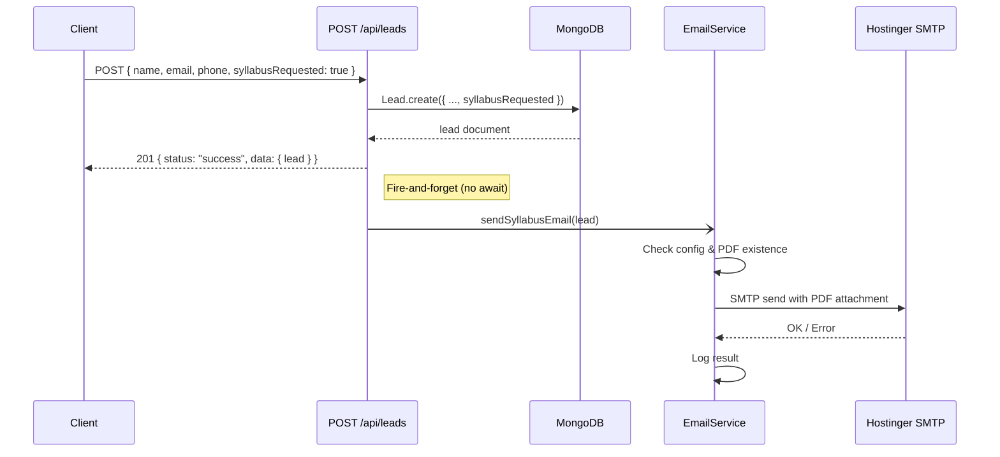

# Design Document: Syllabus Email on Lead

## Overview

This feature adds automatic syllabus PDF email delivery to the existing lead-creation flow. When a lead submits their contact info with `syllabusRequested: true`, the backend sends them the "12-Month Game Development Syllabus" PDF via Hostinger SMTP — without blocking or delaying the lead-creation response.

The design introduces two new components:
1. A `syllabusRequested` boolean field on the Lead model
2. An `emailService` module that wraps Nodemailer configured for Hostinger SMTP

The email is fired asynchronously (fire-and-forget) after the lead is persisted. If the email fails for any reason (missing PDF, SMTP error, missing config), the lead creation still succeeds with a `201` response.

## Architecture



Key architectural decisions:
- **Fire-and-forget**: The route handler does NOT `await` the email send. This keeps response latency unchanged and ensures lead creation never fails due to email issues.
- **Single module**: The email service is a standalone module (`Backend/services/emailService.js`) with no coupling to Express — it receives plain data and returns a promise.
- **Nodemailer**: The standard Node.js email library. It supports SMTP, attachments, and is well-tested. No need to build anything custom.

## Components and Interfaces

### 1. Email Service Module — `Backend/services/emailService.js`

```javascript
/**
 * Validates that all required SMTP env vars are present.
 * Called once at module load; sets an internal flag.
 * @returns {boolean}
 */
function isConfigured()

/**
 * Creates and returns a Nodemailer transporter using Hostinger SMTP settings.
 * @returns {nodemailer.Transporter}
 */
function createTransporter()

/**
 * Sends the syllabus PDF email to a lead.
 * @param {{ name: string, email: string }} lead
 * @returns {Promise<{ success: boolean, error?: string }>}
 */
async function sendSyllabusEmail(lead)
```

Environment variables consumed:
| Variable | Example | Purpose |
|---|---|---|
| `HOSTINGER_SMTP_HOST` | `smtp.hostinger.com` | SMTP server hostname |
| `HOSTINGER_SMTP_PORT` | `465` | SMTP port (SSL) |
| `HOSTINGER_EMAIL` | `info@jainish.space` | Sender address & login |
| `HOSTINGER_EMAIL_PASS` | `••••••` | SMTP password |

### 2. Lead Model Update — `Backend/models/Lead.js`

Add one field to the existing schema:

```javascript
syllabusRequested: {
    type: Boolean,
    default: false
}
```

No index needed — this field is not queried in isolation.

### 3. Lead Route Update — `Backend/routes/leads.js`

Changes to `POST /api/leads`:
- Accept `syllabusRequested` from `req.body` (alongside existing fields)
- Pass it to `Lead.create()`
- After successful creation, if `syllabusRequested === true`, call `sendSyllabusEmail(lead)` without awaiting

No changes to admin endpoints — the field is already included when Mongoose serializes the document.

## Data Models

### Lead Schema (updated)

```javascript
{
    name:              { type: String, required: true, trim: true, maxlength: 100 },
    email:             { type: String, required: true, lowercase: true, trim: true },
    phone:             { type: String, required: true, trim: true, maxlength: 20 },
    status:            { type: String, enum: ['new','contacted','qualified','closed'], default: 'new' },
    note:              { type: String, trim: true, maxlength: 500, default: '' },
    source:            { type: String, trim: true, default: 'external' },
    syllabusRequested: { type: Boolean, default: false },  // ← NEW
    createdAt:         { type: Date, default: Date.now },
    updatedAt:         { type: Date, default: Date.now }
}
```

### Email Payload Structure

```javascript
{
    from:        '"Jainish Gupta" <HOSTINGER_EMAIL>',
    to:          lead.email,
    subject:     'Here is your 12-Month Game Development Syllabus',
    html:        '<p>Hi {name}, ...</p>',
    attachments: [{
        filename: '12-Month Game Development Syllabus.pdf',
        path:     path.join(__dirname, '..', '12-Month Game Development Syllabus.pdf')
    }]
}
```


## Correctness Properties

*A property is a characteristic or behavior that should hold true across all valid executions of a system — essentially, a formal statement about what the system should do. Properties serve as the bridge between human-readable specifications and machine-verifiable correctness guarantees.*

### Property 1: syllabusRequested persistence

*For any* valid lead submission where `syllabusRequested` is set to `true`, the persisted Lead document in MongoDB should have `syllabusRequested === true`.

**Validates: Requirements 1.1**

### Property 2: syllabusRequested defaults to false

*For any* valid lead submission that omits the `syllabusRequested` field, the persisted Lead document should have `syllabusRequested === false`.

**Validates: Requirements 1.2, 5.1**

### Property 3: Validation unchanged by syllabusRequested

*For any* lead submission that violates existing validation rules (missing name, invalid email, or missing phone), the API should return a 400 error regardless of whether `syllabusRequested` is `true` or `false`.

**Validates: Requirements 1.3**

### Property 4: Email triggered on syllabusRequested

*For any* successfully created lead with `syllabusRequested === true`, the Email_Service's `sendSyllabusEmail` function should be invoked with that lead's email address and name.

**Validates: Requirements 2.1**

### Property 5: Email composition correctness

*For any* lead passed to `sendSyllabusEmail`, the composed email should contain an attachment with filename `12-Month Game Development Syllabus.pdf` AND the email body should contain the lead's name.

**Validates: Requirements 2.2, 2.4**

### Property 6: Email failure resilience

*For any* SMTP failure (error, timeout, rejection) during email sending, the lead-creation endpoint should still return a `201` status code with the created lead data, and the error should be logged with the lead identifier and email address.

**Validates: Requirements 3.1, 3.2**

### Property 7: Async email delivery

*For any* lead creation with `syllabusRequested === true`, the HTTP response should be returned before the email sending promise resolves, ensuring email latency does not affect response time.

**Validates: Requirements 3.3**

### Property 8: Admin response includes syllabusRequested

*For any* lead stored in the database, when retrieved via the `GET /api/leads/admin/all` endpoint, the response payload should include the `syllabusRequested` field with its stored value.

**Validates: Requirements 5.2**

## Error Handling

| Scenario | Behaviour | HTTP Response |
|---|---|---|
| Missing/invalid SMTP env vars at startup | Log warning, set `configured = false` | N/A (startup) |
| `sendSyllabusEmail` called when not configured | Return `{ success: false }`, log skip message | 201 (lead still created) |
| Syllabus PDF file not found on disk | Catch `ENOENT`, log error with path | 201 (lead still created) |
| SMTP connection timeout | Catch error, log with lead id + email | 201 (lead still created) |
| SMTP auth failure | Catch error, log with lead id + email | 201 (lead still created) |
| SMTP provider rejects email | Catch error, log with lead id + email | 201 (lead still created) |
| Validation failure (missing name/email/phone) | Return validation errors | 400 |
| Duplicate lead (email or phone) | Return duplicate error | 409 |

The guiding principle: **email failures are never user-facing**. The `sendSyllabusEmail` function wraps its entire body in a try/catch and always resolves (never rejects). The route handler calls it without `await`, so even an unhandled rejection won't crash the request.

## Testing Strategy

### Testing Libraries

- **Unit/Integration tests**: Jest + Supertest (already in use)
- **Property-based tests**: [fast-check](https://github.com/dubzzz/fast-check) — the standard PBT library for JavaScript/TypeScript

`fast-check` needs to be added as a dev dependency:
```bash
cd Backend && npm install --save-dev fast-check
```

### Unit Tests

Unit tests cover specific examples, edge cases, and integration points:

1. **Lead creation with `syllabusRequested: true`** — verify 201 response and field persisted
2. **Lead creation without `syllabusRequested`** — verify default is `false`
3. **Email subject is exactly** `"Here is your 12-Month Game Development Syllabus"` (Req 2.3)
4. **SMTP config read from env vars** — verify transporter uses `HOSTINGER_SMTP_HOST`, `HOSTINGER_SMTP_PORT`, `HOSTINGER_EMAIL`, `HOSTINGER_EMAIL_PASS` (Req 4.1–4.5)
5. **Missing SMTP config** — verify warning logged and email skipped gracefully (Req 4.6)
6. **Missing PDF file** — verify error logged and lead creation succeeds (Req 2.5)
7. **Admin GET includes `syllabusRequested`** — verify field present in response

### Property-Based Tests

Each property test runs a minimum of 100 iterations and is tagged with its design property reference.

- **Feature: syllabus-email-on-lead, Property 1: syllabusRequested persistence** — Generate random valid lead data with `syllabusRequested: true`, POST to API, verify persisted value.
- **Feature: syllabus-email-on-lead, Property 2: syllabusRequested defaults to false** — Generate random valid lead data without `syllabusRequested`, POST to API, verify default.
- **Feature: syllabus-email-on-lead, Property 3: Validation unchanged by syllabusRequested** — Generate random invalid lead data (missing required fields) with random `syllabusRequested` boolean, POST to API, verify 400.
- **Feature: syllabus-email-on-lead, Property 4: Email triggered on syllabusRequested** — Generate random valid leads with `syllabusRequested: true`, mock email service, verify it's called.
- **Feature: syllabus-email-on-lead, Property 5: Email composition correctness** — Generate random lead names/emails, call `sendSyllabusEmail`, verify attachment filename and name in body.
- **Feature: syllabus-email-on-lead, Property 6: Email failure resilience** — Generate random SMTP errors, mock transporter to throw, verify 201 response and error logged.
- **Feature: syllabus-email-on-lead, Property 7: Async email delivery** — Generate random leads, mock a slow email send (delayed promise), verify response returns before email resolves.
- **Feature: syllabus-email-on-lead, Property 8: Admin response includes syllabusRequested** — Generate random leads with random `syllabusRequested` values, create them, GET admin endpoint, verify field present with correct value.

Each property-based test MUST be implemented as a single `fc.assert(fc.asyncProperty(...))` or `fc.assert(fc.property(...))` call. Each test MUST include a comment tag in the format: `// Feature: syllabus-email-on-lead, Property N: <title>`.
